# Data Flows Architecture

## Document Information

| Attribute | Value |
|-----------|-------|
| Project | CLP AI Knowledge Management Platform |
| Version | 1.0 |
| Date | January 14, 2026 |
| Status | Draft |

---

## 1. Overview

This document describes the end-to-end data flows within the CLP AI Knowledge Management Platform, covering ingestion, processing, storage, and consumption patterns.

---

## 2. Data Flow Diagrams

### 2.1 Content Ingestion Flow (Video Processing)

### 2.2 Content Ingestion Flow (Document Processing)

### 2.3 Query Processing Flow (RAG Pipeline)

```mermaid
sequenceDiagram
    autonumber
    participant User as 👤 User<br/>(Junior Engineer)
    participant VoltAI as 🌐 VoltAI<br/>Marketplace
    participant API as ⚡ Chat API<br/>(App Service)
    participant OpenAI as 🤖 Azure OpenAI
    participant Search as 🔍 AI Search<br/>(Vector Index)
    participant Cosmos as 📊 Cosmos DB<br/>(Metadata)

    Note over User,Cosmos: 🔍 RAG QUERY PIPELINE (< 3 seconds end-to-end)

    rect rgb(50, 60, 80)
        Note right of User: Query Submission
        User->>VoltAI: "How do I reset the turbine?"
        VoltAI->>API: Forward authenticated query
    end

    rect rgb(60, 70, 90)
        Note right of OpenAI: Query Understanding & Embedding
        API->>OpenAI: Generate query embedding
        OpenAI-->>API: Query vector [1536 dims]
    end

    rect rgb(70, 80, 100)
        Note right of Search: Hybrid Retrieval
        API->>Search: Vector + keyword search
        Note right of Search: Weight: 0.7 vector / 0.3 keyword<br/>Top-K: 5-10 chunks
        Search->>Search: Semantic reranking
        Search-->>API: Ranked results + scores
        API->>Cosmos: Fetch source metadata
        Cosmos-->>API: Timestamps, URLs, authors
    end

    rect rgb(80, 90, 110)
        Note right of OpenAI: Grounded Response Generation
        API->>API: Assemble context (max 4000 tokens)
        API->>OpenAI: GPT-4o with strict grounding
        Note right of OpenAI: Temperature: 0.1<br/>Must cite sources<br/>Say "I don't know" if unsure
        OpenAI-->>API: Grounded response + citations
    end

    rect rgb(90, 100, 120)
        Note right of User: Response Delivery
        API->>API: Format response with video links
        API-->>VoltAI: JSON response
        VoltAI-->>User: "Reset turbine by pressing<br/>red latch. Watch at [14:30]"
    end

    Note over User,Cosmos: ✅ Answer delivered with clickable video timestamp
```

---

## 3. Data Ingestion Patterns

### 3.1 Video Processing Pipeline

| Step | Component | Input | Output | SLA |
|------|-----------|-------|--------|-----|
| 1 | SharePoint Webhook | File upload event | Event payload | Real-time |
| 2 | Logic Apps | Event payload | Processing trigger | < 1 min |
| 3 | Azure Functions | Video URL | Audio extraction | < 5 min |
| 4 | Speech Services | Audio stream | Transcript + timestamps | ~1x video duration |
| 5 | Chunking | Raw transcript | Timestamped chunks | < 1 min |
| 6 | Embedding | Text chunks | 1536-dim vectors | < 2 min |
| 7 | Indexing | Vectors + metadata | Search index update | < 1 min |

**Total Expected Latency**: 1.5x video duration + 10 minutes

### 3.2 Document Processing Pipeline

| Step | Component | Input | Output | SLA |
|------|-----------|-------|--------|-----|
| 1 | SharePoint Webhook | File upload event | Event payload | Real-time |
| 2 | Logic Apps | Event payload | Processing trigger | < 1 min |
| 3 | Document Parser | PDF/Word file | Extracted text | < 2 min |
| 4 | Chunking | Raw text | Overlapping chunks | < 1 min |
| 5 | Embedding | Text chunks | 1536-dim vectors | < 2 min |
| 6 | Indexing | Vectors + metadata | Search index update | < 1 min |

**Total Expected Latency**: < 10 minutes

### 3.3 Batch vs Real-time Processing

| Pattern | Use Case | Trigger | Processing Time |
|---------|----------|---------|-----------------|
| Real-time | New content upload | SharePoint webhook | Minutes |
| Micro-batch | Content updates | Scheduled (15 min) | Minutes |
| Daily batch | Full reconciliation | Scheduled (daily) | Hours |
| On-demand | Reprocessing | Manual trigger | Variable |

---

## 4. Data Transformation Pipeline

### 4.1 Bronze Layer (Raw)

**Purpose**: Preserve original source data exactly as received.

| Data Type | Format | Storage | Retention |
|-----------|--------|---------|-----------|
| Video files | MP4/MOV | SharePoint (source) | Per CLP policy |
| Documents | PDF/DOCX | SharePoint (source) | Per CLP policy |
| Raw transcripts | JSON | Blob Storage | 7-10 years |
| Processing logs | JSON | Blob Storage | 2 years |

### 4.2 Silver Layer (Processed)

**Purpose**: Cleaned, chunked, and enriched content ready for embedding.

| Data Type | Format | Storage | Retention |
|-----------|--------|---------|-----------|
| Content chunks | JSON | Cosmos DB | Active lifecycle |
| Chunk metadata | JSON | Cosmos DB | Active lifecycle |
| Processing state | JSON | Cosmos DB | 90 days |

### 4.3 Gold Layer (Consumption)

**Purpose**: Optimized for search and retrieval.

| Data Type | Format | Storage | Retention |
|-----------|--------|---------|-----------|
| Vector embeddings | Float32[1536] | AI Search | Active lifecycle |
| Search metadata | JSON | AI Search | Active lifecycle |
| Citation data | JSON | AI Search | Active lifecycle |

---

## 5. Data Storage Strategy

### 5.1 Storage Tiers

| Tier | Temperature | Storage | Use Case | Cost |
|------|-------------|---------|----------|------|
| Hot | Frequent access | AI Search, Cosmos DB | Active queries, metadata | Higher |
| Warm | Occasional access | Blob Storage (Hot) | Recent transcripts | Medium |
| Cold | Rare access | Blob Storage (Cool) | Historical transcripts | Lower |
| Archive | Compliance only | Blob Storage (Archive) | Long-term retention | Lowest |

### 5.2 Data Lifecycle

| Stage | Duration | Action | Storage Tier |
|-------|----------|--------|--------------|
| Active | 0-90 days | Full access | Hot |
| Recent | 90-365 days | Query access | Warm |
| Historical | 1-7 years | Audit access | Cold |
| Archive | 7-10 years | Compliance only | Archive |

### 5.3 Retention Policies

| Data Type | Retention | Justification |
|-----------|-----------|---------------|
| Vector index | Active lifecycle | Required for search |
| Document metadata | 10 years | Compliance requirement |
| Raw transcripts | 7-10 years | Audit trail |
| Query logs | 2 years | Analytics and debugging |
| Processing logs | 90 days | Operational monitoring |

---

## 6. Data Access Patterns

### 6.1 Read Patterns

| Pattern | Frequency | Latency Requirement | Caching |
|---------|-----------|---------------------|---------|
| Vector search | High | < 500ms | No (real-time) |
| Metadata lookup | High | < 100ms | Yes (Redis optional) |
| Citation retrieval | Medium | < 200ms | Yes |
| Analytics queries | Low | < 5s | Yes (aggregated) |

### 6.2 Write Patterns

| Pattern | Frequency | Consistency | Batching |
|---------|-----------|-------------|----------|
| Content indexing | Low-Medium | Eventual | Yes (batch updates) |
| Metadata updates | Low | Strong | No |
| Query logging | High | Eventual | Yes |
| Feedback capture | Low | Strong | No |

### 6.3 Query Processing Details

**Retrieval Configuration**
- Top-K results: 5-10 chunks
- Hybrid search weight: 0.7 vector / 0.3 keyword
- Minimum relevance score: 0.75
- Maximum context tokens: 4000

**Response Generation**
- Temperature: 0.1 (low for factual responses)
- Max response tokens: 1000
- System prompt includes grounding requirements
- Citation format: [Source Title](URL#timestamp)

---

## 7. Data Quality Controls

### 7.1 Validation Rules

| Stage | Validation | Action on Failure |
|-------|------------|-------------------|
| Ingestion | File format check | Reject with error |
| Transcription | Confidence threshold (>70%) | Flag for review |
| Chunking | Token count limits (100-500) | Re-chunk |
| Embedding | Vector dimension check | Retry |
| Indexing | Schema validation | Reject with error |

### 7.2 Quality Metrics

| Metric | Target | Measurement |
|--------|--------|-------------|
| Transcription accuracy | >90% | Sample review |
| Chunk coherence | >95% | Automated check |
| Index freshness | <15 min | Monitoring |
| Query success rate | >90% | Analytics |

---

## 8. Integration Specifications

### 8.1 SharePoint Integration

**Event Types Monitored**
- ItemAdded: New file uploaded
- ItemUpdated: Existing file modified
- ItemDeleted: File removed

**Graph API Endpoints**
- GET /sites/{site-id}/drive/items/{item-id}
- GET /sites/{site-id}/drive/items/{item-id}/content

### 8.2 Azure OpenAI Integration

**Embedding API**
- Endpoint: /openai/deployments/{deployment}/embeddings
- Model: text-embedding-ada-002
- Max tokens: 8191
- Batch size: 100 texts

**Chat Completion API**
- Endpoint: /openai/deployments/{deployment}/chat/completions
- Model: gpt-4
- Max response tokens: 1000
- Temperature: 0.1

### 8.3 AI Search Integration

**Index Operations**
- POST /indexes/{index}/docs/index (batch upload)
- POST /indexes/{index}/docs/search (query)

**Search Configuration**
- Query type: semantic + vector
- Semantic configuration: default
- Vector fields: content_vector
- Select fields: id, content, sourceUrl, timestamp

---

## Related Documents

- [Architecture Overview](overview.md)
- [Security & Governance](security-governance.md)
- [Component Specifications](../../infra/docs/architecture/component-specifications.md)
