# Security & Data Flow Sequence Diagrams

## Document Information

| Attribute | Value |
|-----------|-------|
| Project | CLP AI Knowledge Management Platform |
| Version | 1.0 |
| Date | January 14, 2026 |
| Status | Final |
| Related | [Executive Technical Proposal](../project-context/executive-technical-proposal.md) |

---

## 1. Complete Query Flow with Security Controls

This diagram shows the end-to-end flow from user query to response, including all security checkpoints.

```mermaid
sequenceDiagram
    autonumber
    participant User as 👤 User<br/>(Junior Engineer)
    participant VoltAI as 🌐 VoltAI<br/>Marketplace
    participant AAD as 🔐 Azure AD<br/>(Entra ID)
    participant API as ⚡ Chat API<br/>(App Service)
    participant KV as 🔑 Key Vault
    participant Search as 🔍 Azure AI<br/>Search
    participant OpenAI as 🤖 Azure<br/>OpenAI
    participant Cosmos as 📊 Cosmos DB<br/>(Metadata)
    participant Monitor as 📈 Azure<br/>Monitor
    participant Audit as 📝 Audit<br/>Log

    rect rgb(40, 40, 60)
        Note over User,AAD: 🛡️ AUTHENTICATION PHASE
        User->>VoltAI: Access Knowledge Bot
        VoltAI->>AAD: Redirect to login
        AAD->>AAD: Verify CLP credentials + MFA
        AAD-->>VoltAI: Return JWT token (1hr expiry)
        VoltAI-->>User: Session established
        Audit->>Audit: Log: User login event
    end

    rect rgb(50, 50, 70)
        Note over User,API: 🔒 AUTHORIZATION PHASE
        User->>VoltAI: Query: "How do I reset the turbine?"
        VoltAI->>API: Forward query + JWT token
        API->>AAD: Validate token signature
        AAD-->>API: Token valid + user roles
        API->>API: Check RBAC permissions
        Note right of API: Verify user has<br/>"KB User" role
        Audit->>Audit: Log: Query received + user context
    end

    rect rgb(60, 60, 80)
        Note over API,KV: 🔐 SECRETS RETRIEVAL (Managed Identity)
        API->>KV: Request API keys (System MI)
        Note right of KV: No credentials in code<br/>Managed Identity auth
        KV-->>API: OpenAI key, Search key
    end

    rect rgb(70, 70, 90)
        Note over API,OpenAI: 🧠 QUERY PROCESSING PHASE
        API->>OpenAI: Generate query embedding
        Note right of OpenAI: text-embedding-ada-002<br/>TLS 1.2 encrypted
        OpenAI-->>API: Query vector [1536 dims]
    end

    rect rgb(80, 80, 100)
        Note over API,Cosmos: 🔍 RETRIEVAL PHASE (Private Endpoints)
        API->>Search: Hybrid search (vector + keyword)
        Note right of Search: Private endpoint<br/>No public access
        Search->>Search: Semantic reranking
        Search-->>API: Top-K results + metadata
        API->>Cosmos: Fetch source details
        Note right of Cosmos: Private endpoint<br/>Session consistency
        Cosmos-->>API: Video timestamps, source URLs
    end

    rect rgb(90, 90, 110)
        Note over API,OpenAI: 🎯 GROUNDED GENERATION PHASE
        API->>API: Assemble context (max 4000 tokens)
        API->>OpenAI: GPT-4o with strict grounding
        Note right of OpenAI: System prompt enforces:<br/>1. Only use provided context<br/>2. Include citations<br/>3. Say "I don't know" if unsure
        OpenAI->>OpenAI: Generate grounded response
        OpenAI-->>API: Response + citations
    end

    rect rgb(100, 100, 120)
        Note over API,Audit: ✅ RESPONSE & AUDIT PHASE
        API->>API: Validate response has citations
        API->>Monitor: Log latency, tokens used
        API->>Audit: Log: Full query audit trail
        Note right of Audit: Query, retrieved docs,<br/>response, user, timestamp
        API-->>VoltAI: JSON response + video links
        VoltAI-->>User: "Reset turbine by pressing<br/>red latch. See [14:30]"
    end
```

---

## 2. Content Ingestion Security Flow

This diagram shows how content from SharePoint is securely processed and indexed.

---

## 3. Security Controls Summary

```mermaid
flowchart TB
    subgraph Identity["🔐 Identity & Access"]
        A1[Azure AD / Entra ID]
        A2[MFA Required]
        A3[RBAC Roles]
        A4[JWT Tokens - 1hr expiry]
    end

    subgraph Network["🌐 Network Security"]
        B1[Private Endpoints]
        B2[VNet Integration]
        B3[NSG Rules]
        B4[No Public Access to Data]
    end

    subgraph Data["🛡️ Data Protection"]
        C1[TLS 1.2 In Transit]
        C2[AES-256 At Rest]
        C3[Key Vault for Secrets]
        C4[Managed Identities]
    end

    subgraph Governance["📋 Governance"]
        D1[Full Audit Trail]
        D2[Query Logging]
        D3[Azure Monitor]
        D4[Cost Controls]
    end

    subgraph AI["🤖 AI Safety"]
        E1[Strict Grounding]
        E2[Citation Required]
        E3[Confidence Scoring]
        E4["I Don't Know" Fallback]
    end

    Identity --> Network
    Network --> Data
    Data --> Governance
    Governance --> AI
```

---

## 4. Data Residency & Compliance Flow

---

## 5. Threat Model & Mitigations

| Threat Vector | Control | Implementation |
|---------------|---------|----------------|
| **Unauthorized Access** | Azure AD + MFA | All users authenticate via corporate identity |
| **Token Theft** | Short-lived JWTs | 1-hour expiry, refresh token rotation |
| **Data Exfiltration** | Private Endpoints | No public IP access to data stores |
| **Man-in-the-Middle** | TLS 1.2 | All traffic encrypted in transit |
| **Insider Threat** | RBAC + Audit | Role-based access, complete audit trail |
| **AI Hallucination** | Strict Grounding | Response must cite source or decline |
| **Prompt Injection** | Input Validation | Sanitize queries, system prompt isolation |
| **Cost Attack (DoS)** | Rate Limiting | Per-user query limits, budget alerts |

---

## Related Documents

- [Executive Technical Proposal](../project-context/executive-technical-proposal.md)
- [Security & Governance](security-governance.md)
- [Data Flows](data-flows.md)
- [Network Security](../../infra/docs/architecture/network-security.md)
