# Technical Proposal: CLP Next-Gen Knowledge Platform
## Turning Information into Organizational Power

## Document Information

| Attribute | Value |
|-----------|-------|
| Project | CLP AI Knowledge Management |
| Document Type | Executive Technical Proposal |
| Version | 1.0 |
| Date | January 14, 2026 |
| Status | Final |
| Target Audience | Executive Leadership, Decision Makers |
| Related Documents | [Business Case](business-case.md), [Value Delivery Roadmap](value-delivery-roadmap.md), [Tech Stack](tech-stack.md) |

---

## 1. Executive Summary: The Struggle for Institutional Memory

### The Business Case (The ThinkSchool Perspective)

Let's break this down. In any major utility organization like CLP, **Knowledge is Power**. But right now, that power is leaking. You have senior engineers—your most valuable assets—holding decades of operational wisdom. They are retiring or moving on. What do they leave behind? Hours of unstructured video recordings and folders of PDF manuals on SharePoint.

For a junior engineer, this isn't "knowledge"; it is **noise**. Searching through a 2-hour video for a 30-second calibration procedure is an operational inefficiency that bleeds money and increases safety risks.

### The Power Dynamic (The Pfeffer Perspective)

To maintain influence and control in a shifting landscape, leadership must capture this "tribal knowledge" and institutionalize it. This proposal is not just about building a chatbot; it is about building an **Intelligence Engine**. By centralizing this data into a controllable, queryable AI platform, you are not just helping juniors; you are securing the organization's brain against attrition. We are moving from "passive storage" (SharePoint) to "active intelligence" (RAG).

### The Strategic Imperative

This initiative addresses three critical organizational challenges:

1. **Knowledge Attrition Risk**: Senior experts retiring with irreplaceable operational knowledge
2. **Operational Inefficiency**: Junior staff spending hours searching for 30-second answers
3. **Safety & Compliance**: Inability to quickly access critical procedures increases risk exposure

---

## 2. Technical Approach: The "Video-to-Precision" Engine

Standard RAG (Retrieval-Augmented Generation) models fail at video because they treat it as a black box. Our approach is different. We focus on **Temporal Precision**.

### Multimodal Ingestion

We don't just "watch" the video. We use **Azure Video Indexer** to extract:
- **Speech Transcription**: Full audio-to-text conversion with timestamp precision
- **OCR (Optical Character Recognition)**: Text visible on screen, diagrams, and overlays
- **Visual Cues**: Scene detection, equipment identification, and procedural steps
- **Metadata Extraction**: Speaker identification, location context, equipment type

### The "K2" Jargon Layer

Generic models fail on industry specifics. We will implement a custom dictionary injection strategy to ensure the model distinguishes between general electrical terms and CLP-specific "K2" jargon.

**Implementation Strategy**:
- Custom embedding space for CLP-specific terminology
- Domain-specific entity recognition
- Contextual disambiguation (e.g., "K2" in different operational contexts)
- Continuous jargon dictionary expansion based on query patterns

### Strict Grounding (The Guardrails)

In the utility sector, a hallucination is a safety hazard. Our architecture uses "Strict Grounding"—if the answer isn't in your SharePoint or Videos, the AI will explicitly say, *"I don't know."* It will never guess.

**Safety Mechanisms**:
- **Citation Requirement**: Every response includes source document/video reference
- **Confidence Scoring**: Low-confidence responses trigger "I don't know" behavior
- **Source Verification**: All retrieved content verified against indexed knowledge base
- **Audit Trail**: Complete logging of query, retrieval, and generation for compliance

---

## 3. Technical Flow: From Raw Data to Actionable Insight

### Step 1: Ingest (The Trigger)

A file is dropped into a watched SharePoint folder. The system automatically detects and queues the content for processing.

**Supported Content Types**:
- Video files (MP4, AVI, MOV, WMV)
- Training documents (PDF, DOCX, PPTX)
- Teams meeting recordings
- Technical manuals and procedures

### Step 2: Process (The Translator)

**For Video Content**:
- **Azure Video Indexer** breaks video into scenes
- Generates a transcript with **Time-Codes (00:14:30 - 00:15:15)**
- Extracts visual text via OCR
- Identifies speakers and equipment
- Detects procedural steps and key moments

**For Document Content**:
- **Azure AI Document Intelligence** parses structure
- Extracts text, tables, diagrams
- Maintains document hierarchy and context
- Preserves formatting and references

### Step 3: Index (The Memory)

- Text is chunked using intelligent semantic boundaries
- Embeddings generated using **Azure OpenAI (text-embedding-ada-002)**
- Metadata attached:
  - Author/Creator
  - Timestamp/Creation Date
  - Device Type/Equipment
  - Department/Category
  - Source Location (SharePoint path)
  - Video timestamps (for video content)
- Stored in **Azure AI Search** (Vector Database) with hybrid search capabilities

### Step 4: Retrieval (The Query)

User asks: *"How do I reset the turbine?"*

**The system performs**:
1. **Query Understanding**: Parse intent and extract key entities
2. **Hybrid Search**: Combines keyword matching with semantic similarity
3. **Reranking**: Azure AI Search Semantic Ranker orders results by relevance
4. **Context Assembly**: Retrieves top-k most relevant chunks with full metadata

### Step 5: Generation (The Power Move)

- **LLM (GPT-4o)** synthesizes the answer from retrieved context
- **Grounding Enforcement**: Response limited to provided context only
- **Citation Generation**: Automatic linking to source documents/videos

**Crucial Output**: *"Reset the turbine by pressing the red latch. Watch the demonstration here at [14:30]."*

The response includes:
- Direct answer to the question
- Step-by-step procedure (if applicable)
- Video timestamp link (clickable, jumps to exact moment)
- Source document reference
- Related topics/procedures

---

## 4. High-Level Architecture (Microsoft Azure)

We leverage a serverless, scalable architecture to keep "Time-to-Market" fast and "Cost-to-Serve" low.

### Architecture Components

```
┌─────────────────────────────────────────────────────────────────┐
│                    PRESENTATION LAYER                           │
├─────────────────────────────────────────────────────────────────┤
│  ┌─────────────────┐  ┌─────────────────┐  ┌─────────────────┐ │
│  │ Microsoft Teams │  │  Web Chat UI    │  │ VoltAI Market   │ │
│  │    Bot          │  │  (Next.js)      │  │   place         │ │
│  └─────────────────┘  └─────────────────┘  └─────────────────┘ │
└─────────────────────────────────────────────────────────────────┘
                               │
┌─────────────────────────────────────────────────────────────────┐
│                    ORCHESTRATION LAYER                          │
├─────────────────────────────────────────────────────────────────┤
│  ┌─────────────────┐  ┌─────────────────┐  ┌─────────────────┐ │
│  │ Azure AI Studio │  │ Semantic Kernel │  │  Azure Bot      │ │
│  │   Orchestrator  │  │     Logic       │  │   Service       │ │
│  └─────────────────┘  └─────────────────┘  └─────────────────┘ │
└─────────────────────────────────────────────────────────────────┘
                               │
┌─────────────────────────────────────────────────────────────────┐
│                    INTELLIGENCE LAYER                           │
├─────────────────────────────────────────────────────────────────┤
│  ┌─────────────────┐  ┌─────────────────┐  ┌─────────────────┐ │
│  │ Azure OpenAI    │  │ Azure AI Search │  │  Vector Index   │ │
│  │   GPT-4o        │◄─┤  (Semantic)     │◄─┤   Database      │ │
│  └─────────────────┘  └─────────────────┘  └─────────────────┘ │
└─────────────────────────────────────────────────────────────────┘
                               │
┌─────────────────────────────────────────────────────────────────┐
│                    PROCESSING LAYER                             │
├─────────────────────────────────────────────────────────────────┤
│  ┌─────────────────┐  ┌─────────────────┐  ┌─────────────────┐ │
│  │ Azure Video     │  │ Azure Speech    │  │ Azure Document  │ │
│  │   Indexer       │  │   Services      │  │  Intelligence   │ │
│  └─────────────────┘  └─────────────────┘  └─────────────────┘ │
└─────────────────────────────────────────────────────────────────┘
                               │
┌─────────────────────────────────────────────────────────────────┐
│                    DATA LAYER                                   │
├─────────────────────────────────────────────────────────────────┤
│  ┌─────────────────┐  ┌─────────────────┐  ┌─────────────────┐ │
│  │  SharePoint     │  │ Azure Cosmos DB │  │ Azure Blob      │ │
│  │   (Source)      │  │   (Metadata)    │  │   Storage       │ │
│  └─────────────────┘  └─────────────────┘  └─────────────────┘ │
└─────────────────────────────────────────────────────────────────┘
                               │
┌─────────────────────────────────────────────────────────────────┐
│                    GOVERNANCE LAYER                             │
├─────────────────────────────────────────────────────────────────┤
│  ┌─────────────────┐  ┌─────────────────┐  ┌─────────────────┐ │
│  │ Azure AI        │  │ Application     │  │ Azure Monitor   │ │
│  │   Foundry       │  │   Insights      │  │   & Alerts      │ │
│  └─────────────────┘  └─────────────────┘  └─────────────────┘ │
└─────────────────────────────────────────────────────────────────┘
```

### Component Descriptions

| Component | Purpose | Key Features |
|-----------|---------|--------------|
| **Front-End** | User interaction | Microsoft Teams Bot, Web Chat (Next.js), VoltAI Marketplace |
| **Orchestration** | Logic management | Azure AI Studio, Semantic Kernel for workflow orchestration |
| **Intelligence** | AI capabilities | Azure OpenAI Service (GPT-4o), Azure AI Search with semantic ranker |
| **Processing** | Content transformation | Azure Video Indexer, Azure Speech Services, Azure Document Intelligence |
| **Data** | Content storage | SharePoint (source), Azure Cosmos DB (metadata), Azure Blob Storage |
| **Governance** | Monitoring & control | Azure AI Foundry (usage, costs, access), Application Insights, Azure Monitor |

### Regional Deployment

- **Primary Region**: Azure Hong Kong (East Asia) - Data residency compliance
- **Disaster Recovery**: Azure Southeast Asia (secondary region)
- **Latency**: <100ms for 95th percentile queries
- **Availability**: 99.9% SLA with automated failover

---

## 5. Roadmap: The Evolution of Influence

We propose a **"Land and Expand"** strategy. We start by solving the immediate pain (Search) and then scale to transform the learning culture (Avatars).

### Phase 1: The "Intelligence Desk" (MVP - Early February 2026)

**Goal**: Stop the bleeding. Enable juniors to find answers instantly.

**Timeline**: 6 weeks (Weeks 1-6)

**Scope**:
- SharePoint Connector + Video Indexer + Basic Chatbot
- 100% of approved training videos transcribed and indexed
- Natural language query interface via VoltAI Marketplace
- Video timestamp navigation
- Document source citations
- CLP-specific jargon handling (initial "K2" dictionary)

**Outcome**: A deployed bot that answers questions with timestamped video links.

**Success Metrics**:
- Query response time: <3 seconds
- Timestamp accuracy: ±10 seconds
- Citation accuracy: >90%
- User query resolution: >80% answered without escalation

**Deliverables**:
1. Data ingestion pipeline (SharePoint → Azure)
2. Video transcription with timestamps
3. Document parsing and indexing
4. RAG chatbot API
5. VoltAI Marketplace integration
6. Basic monitoring and alerting
7. User documentation and training materials

---

#### 📊 Phase 1 Detailed Breakdown (Slide-Ready)

##### 🎯 SLIDE 1: The Problem We're Solving

| Pain Point | Current State | Impact |
|------------|---------------|--------|
| **Knowledge Trapped in Video** | 2-hour videos for 30-second answers | Hours wasted per query |
| **Senior Expert Bottleneck** | Juniors ask same questions repeatedly | 10+ hrs/week lost productivity |
| **Tribal Knowledge Risk** | Expertise lives in people's heads | Single point of failure |
| **SharePoint = Digital Graveyard** | Files uploaded, never found | 80% content never accessed |

**The Burning Platform**: Every retiring expert takes decades of knowledge with them.

---

##### 🏗️ SLIDE 2: What We're Building (6 Weeks)

```
┌─────────────────────────────────────────────────────────────────┐
│                    THE INTELLIGENCE DESK                        │
│                   "Ask. Find. Do. In Seconds."                  │
├─────────────────────────────────────────────────────────────────┤
│                                                                 │
│    ┌─────────┐      ┌─────────┐      ┌─────────────────┐       │
│    │  ASK    │ ──▶  │  FIND   │ ──▶  │  WATCH @ 14:30  │       │
│    │ Natural │      │ AI RAG  │      │  Exact Moment   │       │
│    │Language │      │ Search  │      │  + Citation     │       │
│    └─────────┘      └─────────┘      └─────────────────┘       │
│                                                                 │
│    "How do I          Top 5              "Press red latch.     │
│     reset the         relevant           Watch demo here        │
│     turbine?"         chunks             [VIDEO @ 14:30]"       │
│                                                                 │
└─────────────────────────────────────────────────────────────────┘
```

**Key Differentiator**: Not just search—**temporal precision** with video timestamps.

---

##### 📅 SLIDE 3: Sprint-by-Sprint Roadmap

| Sprint | Week | Focus Area | Key Milestone |
|--------|------|------------|---------------|
| **Sprint 1** | 1-2 | 🔧 **Foundation** | Azure environment + SharePoint connection live |
| **Sprint 2** | 3-4 | 🎬 **Content Engine** | 10+ videos transcribed with timestamps |
| **Sprint 3** | 5-6 | 🤖 **Intelligence Layer** | RAG chatbot deployed to VoltAI |

**Sprint 1: Foundation (Weeks 1-2)**
- [ ] Azure resource provisioning (OpenAI, AI Search, Cosmos DB)
- [ ] SharePoint Graph API integration
- [ ] Logic Apps webhook triggers configured
- [ ] Basic CI/CD pipeline established
- [ ] Security baseline (RBAC, Key Vault)

**Sprint 2: Content Engine (Weeks 3-4)**
- [ ] Video Indexer pipeline operational
- [ ] Speech-to-text with word-level timestamps
- [ ] Document Intelligence parsing
- [ ] Semantic chunking service
- [ ] Embedding generation (ada-002)
- [ ] AI Search index populated

**Sprint 3: Intelligence Layer (Weeks 5-6)**
- [ ] RAG chatbot API development
- [ ] Grounding enforcement (no hallucinations)
- [ ] Citation generation with video links
- [ ] VoltAI Marketplace integration
- [ ] UAT with pilot users
- [ ] Go-live preparation

---

##### 🎬 SLIDE 4: Video Processing Magic

```mermaid
graph LR
    A[📹 Training Video<br/>2 hours] --> B[🎤 Azure Speech<br/>Transcription]
    B --> C[⏱️ Timestamped<br/>Transcript]
    C --> D[✂️ Smart<br/>Chunking]
    D --> E[🧮 Embeddings<br/>1536-dim vectors]
    E --> F[🔍 AI Search<br/>Index]
    
    style A fill:#ff6b6b
    style F fill:#4ecdc4
```



**What Happens to a 2-Hour Video**:

| Stage | Input | Output | Time |
|-------|-------|--------|------|
| **Upload** | MP4 file → SharePoint | Webhook trigger | Instant |
| **Transcribe** | Audio stream | Text + timestamps | ~2 hours |
| **Chunk** | Raw transcript | 50-100 chunks | < 1 min |
| **Embed** | Text chunks | Vectors | < 2 min |
| **Index** | Vectors + metadata | Searchable | < 1 min |

**Result**: Every sentence tagged with its exact video timestamp.

---

##### 🔍 SLIDE 5: The Query Experience

**User Journey: Junior Engineer Needs Help**

```
BEFORE (Today)                         AFTER (Phase 1)
─────────────────                      ─────────────────
1. Open SharePoint                     1. Open VoltAI chat
2. Search "turbine reset"              2. Type: "How do I reset turbine?"
3. Find 15 videos                      3. Get instant answer:
4. Open first video (2 hrs)               
5. Scrub through...                    ┌─────────────────────────────┐
6. Wrong video                         │ "To reset the turbine:      │
7. Try next video...                   │  1. Press the red latch     │
8. Give up                             │  2. Hold for 3 seconds      │
9. Walk to senior's desk               │  3. Wait for green light    │
10. Interrupt their work               │                             │
                                       │ 📹 Watch demo: [14:30]      │
⏱️ Time: 45 minutes                    │ 📄 Source: Turbine_Manual   │
😤 Frustration: High                   └─────────────────────────────┘
                                       
                                       ⏱️ Time: 30 seconds
                                       😊 Confidence: High
```

---

##### 🛡️ SLIDE 6: Safety First - Strict Grounding

**Why This Matters in Utilities**: A hallucinated answer = safety incident.

| Guardrail | Implementation | Example |
|-----------|----------------|---------|
| **Citation Required** | Every answer links to source | "See Turbine Manual, Page 23" |
| **Confidence Scoring** | Low confidence → decline | "I don't have information on that" |
| **No Fabrication** | Only indexed content | Won't guess procedures |
| **Audit Trail** | Log every query + response | Compliance-ready |

**The Promise**: If it's not in your content, the bot says **"I don't know"**.

```
❌ Bad (Generic AI)          ✅ Good (Our RAG)
──────────────────           ──────────────────
"The turbine reset           "To reset the turbine, press
 involves pressing            the red latch as shown in
 the main switch..."          [Training Video @ 14:30].
                              
 (MADE UP - DANGEROUS!)       Source: Turbine_Ops_2024.mp4"
```

---

##### 📊 SLIDE 7: Success Metrics Dashboard

| Metric | Target | How We Measure | Why It Matters |
|--------|--------|----------------|----------------|
| **Query Response Time** | < 3 seconds | App Insights P95 | User experience |
| **Timestamp Accuracy** | ± 10 seconds | Manual testing | Trust in citations |
| **Citation Accuracy** | > 90% | User feedback | Safety compliance |
| **Query Resolution** | > 80% | No escalation needed | Productivity gain |
| **User Adoption** | 80% pilot active | Weekly active users | Change management |
| **System Uptime** | 99.5% | Azure Monitor | Reliability |
| **Content Coverage** | 100% approved videos | Inventory check | Knowledge capture |

---

##### 💰 SLIDE 8: Phase 1 Investment Summary

| Category | Cost | Notes |
|----------|------|-------|
| **Labor (6 weeks)** | $82,500 | PM/Architect + Data Scientist |
| **Azure (6 months)** | $35,000 - $50,000 | Prorated ramp-up |
| **Contingency (10%)** | $11,750 - $13,250 | Risk buffer |
| **Total Phase 1** | **$129,250 - $145,750** | |

**ROI Preview** (6-month post-launch):

| Impact | Calculation | Value |
|--------|-------------|-------|
| Junior onboarding: 12→8 weeks | 4 weeks × $2,000/week × 10 hires | $80,000 saved |
| Senior time freed: 7 hrs/week | 7 hrs × $100/hr × 52 weeks × 5 seniors | $182,000 saved |
| **Total Annual Savings** | | **$262,000** |
| **ROI** | ($262K - $140K) / $140K | **87%** |

---

##### ✅ SLIDE 9: Deliverables Checklist

| # | Deliverable | Description | Sprint |
|---|-------------|-------------|--------|
| 1 | **Data Ingestion Pipeline** | SharePoint → Logic Apps → Azure Functions → Storage | 1 |
| 2 | **Video Transcription** | Azure Speech Services with word-level timestamps | 2 |
| 3 | **Document Parsing** | Azure Document Intelligence for PDFs/DOCX | 2 |
| 4 | **Embedding & Indexing** | Azure OpenAI + AI Search vector store | 2 |
| 5 | **RAG Chatbot API** | Grounded generation with citations | 3 |
| 6 | **VoltAI Integration** | Chat interface in marketplace | 3 |
| 7 | **Monitoring** | App Insights + Azure Monitor dashboards | 3 |
| 8 | **User Documentation** | Training materials + quick-start guide | 3 |

---

##### 🚀 SLIDE 10: Week 1 Kickoff Plan

**Day 1-2: Environment Setup**
- [ ] Azure subscription provisioned
- [ ] Resource group created (rg-clp-kb-dev)
- [ ] Azure OpenAI quota approved
- [ ] Key Vault configured

**Day 3-4: Integration Setup**
- [ ] SharePoint app registration
- [ ] Graph API permissions granted
- [ ] Test webhook connection
- [ ] Sample video uploaded

**Day 5: Team Alignment**
- [ ] Architecture walkthrough
- [ ] Sprint 1 backlog refined
- [ ] Risk register reviewed
- [ ] Communication plan confirmed

**End of Week 1 Demo**: Live SharePoint → Azure trigger working.

---

##### 🎯 SLIDE 11: Go/No-Go Decision Points

| Checkpoint | Timing | Criteria | Decision |
|------------|--------|----------|----------|
| **Sprint 1 Review** | End Week 2 | Azure infra working, SharePoint connected | Continue / Adjust |
| **Sprint 2 Review** | End Week 4 | 10+ videos indexed, search returning results | Continue / Pivot |
| **UAT Readiness** | Week 5 | Bot answering questions with citations | Proceed to UAT |
| **Go-Live Gate** | Week 6 | All success metrics trending green | Launch / Delay |

**Exit Criteria for Phase 1 Success**:
- ✅ 100% approved videos transcribed and indexed
- ✅ < 3 second query response time
- ✅ > 90% citation accuracy in UAT
- ✅ 10 pilot users trained and active
- ✅ Monitoring dashboards operational

---

##### 📋 SLIDE 12: Key Assumptions

**For Phase 1 success, we assume the following conditions are met:**

| Category | Assumption | Risk if Not Met | Mitigation |
|----------|------------|-----------------|------------|
| **Content Access** | SharePoint folders with training videos are accessible via Graph API | Pipeline cannot ingest content | Early SharePoint permissions setup in Week 1 |
| **Content Quality** | Training videos have clear audio for transcription (minimal background noise) | Low transcription accuracy | Pre-screen content; prioritize high-quality videos |
| **Azure Quota** | Azure OpenAI GPT-4o and embedding quotas approved for Hong Kong region | Processing delays | Submit quota request immediately; have fallback region |
| **Stakeholder Availability** | Key stakeholders available for weekly reviews and UAT feedback | Misaligned deliverables | Lock calendars upfront; async feedback option |
| **Data Residency** | All data must remain in Hong Kong (Azure East Asia) | Compliance violation | Architecture enforces regional deployment |
| **Network Connectivity** | CLP network allows outbound HTTPS to Azure services | Integration failures | Whitelist Azure endpoints; test early |

---

**Technical Assumptions**:

| # | Assumption | Validation Method |
|---|------------|-------------------|
| 1 | **Video Format**: Training videos are in supported formats (MP4, AVI, MOV, WMV) | Content audit in Week 1 |
| 2 | **Language**: Primary content is in English or Cantonese (Azure Speech supported) | Confirm with content owners |
| 3 | **Volume**: Initial pilot scope is 20-50 training videos (< 100 hours total) | Content inventory review |
| 4 | **Jargon Dictionary**: CLP will provide initial "K2" terminology list for custom embedding | SME workshop in Sprint 1 |
| 5 | **User Accounts**: Pilot users have Microsoft 365 accounts with VoltAI access | IT confirmation |
| 6 | **SSO Integration**: Azure AD (Entra ID) is the identity provider for all users | Architecture alignment |

---

**Organizational Assumptions**:

| # | Assumption | Owner | Deadline |
|---|------------|-------|----------|
| 1 | **Executive Sponsorship**: Project has visible support from leadership | Sponsor | Day 1 |
| 2 | **Change Management**: Communication plan exists for pilot user onboarding | PMO | Week 2 |
| 3 | **SME Participation**: 2-3 senior engineers available for jargon training & UAT | Department Head | Week 3 |
| 4 | **Feedback Culture**: Pilot users will actively report issues and suggestions | Team Leads | Ongoing |
| 5 | **Content Governance**: Clear process exists for approving new video uploads | Content Owner | Week 4 |

---

**Infrastructure Assumptions**:

```
┌─────────────────────────────────────────────────────────────────┐
│                    ASSUMED READY STATE                          │
├─────────────────────────────────────────────────────────────────┤
│                                                                 │
│  ✅ Azure Subscription          → Active with billing           │
│  ✅ Azure AD Tenant             → Configured with MFA           │
│  ✅ SharePoint Online           → Videos accessible             │
│  ✅ Network Firewall            → Azure endpoints whitelisted   │
│  ✅ VoltAI Marketplace          → Bot deployment slot ready     │
│  ✅ Development Environment     → Team has access to repos      │
│                                                                 │
└─────────────────────────────────────────────────────────────────┘
```

---

**Dependency Chain**:


**Legend**: 🟡 Yellow = External dependency (CLP-owned)

---

**Knowledge Platform-Specific Checkpoints**:

| Checkpoint | Validation Question | Owner | Sprint |
|------------|---------------------|-------|--------|
| **Content Readiness** | Are 10+ high-priority videos identified and accessible? | Content Owner | 1 |
| **Jargon Baseline** | Is the initial K2 terminology list documented? | SME Lead | 1 |
| **Transcription Quality** | Does sample transcription achieve >85% accuracy? | Data Scientist | 2 |
| **Search Relevance** | Do test queries return correct video segments? | QA Lead | 2 |
| **Citation Accuracy** | Are timestamps within ±10 seconds of actual content? | QA Lead | 3 |
| **User Experience** | Can pilot users complete 5 test queries successfully? | UAT Lead | 3 |

---

**Assumption Sign-Off**:

> ⚠️ **Action Required**: Before Sprint 1 kickoff, stakeholders must confirm these assumptions are valid. Any false assumptions should be flagged immediately to adjust scope or timeline.

| Assumption Category | Confirmed By | Date |
|---------------------|--------------|------|
| Content Access | _______________ | ___/___/___ |
| Technical Requirements | _______________ | ___/___/___ |
| Organizational Readiness | _______________ | ___/___/___ |
| Infrastructure | _______________ | ___/___/___ |

---

### Phase 2: The "Learning Empire" (Future State - Weeks 7-24)

**Goal**: Active Knowledge Transfer and Enterprise-Scale Intelligence

#### Phase 2A: Content Expansion & Management (Weeks 7-12)

**Features**:
- **Management Console**: Next.js admin dashboard for content governance
- **Multi-department Content**: Expand to HR, Legal, and additional Technical domains
- **Query Analytics**: Dashboard showing popular questions, knowledge gaps, and user patterns
- **Feedback Loop**: User satisfaction ratings and continuous improvement
- **Enhanced Jargon**: Expanded "K2" dictionary based on Phase 1 learnings

#### Phase 2B: Multi-Agent System (Weeks 13-18)

**Features**:
- **Specialized Agents**: Department-specific agents for HR, Legal, and Engineering
  - HR Agent: Policies, benefits, onboarding procedures
  - Legal Agent: Compliance, contracts, regulatory requirements
  - Technical Agent: Equipment, procedures, troubleshooting
- **Azure AI Foundry Orchestration**: Intelligent routing to appropriate agent
- **Agent Governance**: Model behavior monitoring and usage analytics

#### Phase 2C: AI Avatar & Advanced Capabilities (Weeks 19-24)

**Features**:
- **AI Avatars**: Use Text-to-Speech Avatars to "present" the manuals, giving a human face to the AI
  - Senior expert digital twins (with consent)
  - Personalized training delivery
  - Interactive classroom presentations
- **Auto-Documentation**: The AI watches the video and *writes* the step-by-step PDF manual for you
- **Short Video Generation**: Automatically create focused video clips from longer training sessions
- **Viva Learning Integration**: Embed chatbot and avatar into Microsoft learning platform

---

## 6. Delivery Approach

We utilize an **Agile/Hybrid** delivery model. In a power-dynamic environment, "black box" development kills trust. We operate with high transparency.

### Methodology

**Framework**: Agile Scrum with 2-week sprints

**Sprint Cadence**:
- **Sprint Planning**: Monday (Week Start) - 2 hours
- **Daily Stand-ups**: 15 minutes (async via Teams for distributed team)
- **Sprint Review**: Friday (Week End) - 1 hour with stakeholders
- **Sprint Retrospective**: Friday (Week End) - 30 minutes (team only)

### Transparency & Stakeholder Engagement

**Show & Tell Every Friday**:
- Live demo of current build to stakeholders
- Builds political capital for project sponsors by showing constant progress
- Opportunity for early feedback and course correction
- Reduces risk of end-stage surprises

**Governance Board (Bi-weekly)**:
- Review "Knowledge Gaps" (questions the bot failed to answer)
- Prioritize new content uploads
- Assess user adoption metrics
- Adjust roadmap based on business priorities

### Quality Assurance

**Continuous Testing**:
- Automated unit tests (>80% code coverage)
- Integration tests for all Azure service interactions
- End-to-end tests for critical user journeys
- Security scanning (Bandit, Azure Security Center)
- Performance testing (load, stress, scalability)

**User Acceptance Testing (UAT)**:
- Pilot user group (10-15 junior staff) for Phase 1
- Weekly feedback sessions
- Bug triage and prioritization
- Feature refinement based on real usage

### Risk Mitigation

| Risk | Mitigation Strategy |
|------|---------------------|
| **Data Quality** | Pilot with curated, high-quality content; iterative expansion |
| **User Adoption** | Early stakeholder involvement; comprehensive training program |
| **Azure Cost Overruns** | Real-time cost monitoring; budget alerts; optimization recommendations |
| **Technical Complexity** | Experienced team; proven architecture patterns; Microsoft partnership |
| **Security & Compliance** | Azure Hong Kong region; RBAC; audit logging; regular security reviews |

---

## 7. Team Composition & Commercials

To execute a project of this strategic importance, you cannot rely on generalists. You need a **Special Forces** unit. We provide top-tier talent focused on execution and delivery.

### Core Team Structure

| Role | Responsibility | Daily Rate (USD) | Phase 1 Duration | Total (Phase 1) |
|------|---------------|------------------|------------------|-----------------|
| **Program Manager / Solution Architect** | **The Strategist.** Owns the architecture, stakeholder management, and technical alignment. Ensures the "Power Dynamic" remains in CLP's favor. Leads architecture decisions, risk management, and executive communication. | **$1,450.00** | 6 weeks (30 days) | **$43,500.00** |
| **Data Scientist (GenAI Level 2)** | **The Builder.** Specializes in Vector/Hybrid search tuning, Prompt Engineering, and "K2" jargon training. Implements RAG pipeline, embedding strategies, and model fine-tuning. | **$1,300.00** | 6 weeks (30 days) | **$39,000.00** |

**Phase 1 Labor Total**: **$82,500.00**

### Extended Team (As Needed)

| Role | Daily Rate (USD) | Phase 2/3 Applicability |
|------|------------------|------------------------|
| Senior Backend Engineer | $1,200.00 | Phase 2A (Management Console API) |
| Senior Frontend Engineer (Next.js) | $1,100.00 | Phase 2A (Management Console UI) |
| DevOps Engineer (Azure) | $1,050.00 | All Phases (Infrastructure, CI/CD) |
| QA Engineer (Test Automation) | $950.00 | All Phases (Quality Assurance) |
| Technical Writer | $850.00 | All Phases (Documentation) |

### Azure Infrastructure Costs (Estimated Year 1)

**Phase 1 (MVP) - Monthly Costs**:

| Service | Tier/SKU | Estimated Monthly Cost |
|---------|----------|------------------------|
| Azure OpenAI Service | GPT-4o (60K TPM), Ada-002 embeddings | $3,500 - $5,000 |
| Azure AI Search | Standard S1 (25GB, 1 replica) | $250 - $350 |
| Azure Video Indexer | Standard (20 hours/month) | $400 - $600 |
| Azure Speech Services | Standard (transcription) | $200 - $300 |
| Azure Cosmos DB | Serverless (metadata) | $100 - $200 |
| Azure App Service | S2 (2 cores, 3.5GB RAM) | $150 - $200 |
| Azure Blob Storage | Hot tier (500GB) | $50 - $100 |
| Application Insights | Standard | $100 - $150 |
| Azure Monitor | Logs + Metrics | $50 - $100 |

**Note**: Azure OpenAI TPM (Tokens Per Minute) allocation varies by model and region. Production deployments may require quota increase requests through Azure support. Costs shown assume standard regional pricing for Hong Kong (East Asia).

**Phase 1 Monthly Azure Total**: **$4,800 - $7,000**  
**Phase 1 Annual Azure Total (prorated)**: **~$35,000 - $50,000** (assuming 6-month ramp-up)

**Full Year 1 Azure Total (including Phase 2 scale-up)**: **$60,000 - $90,000**

### Total Cost Breakdown (Phase 1)

| Category | Cost Range |
|----------|------------|
| **Labor (6 weeks)** | $82,500 |
| **Azure Infrastructure (6 months, prorated)** | $35,000 - $50,000 |
| **Contingency (10%)** | $11,750 - $13,250 |
| **Total Phase 1** | **$129,250 - $145,750** |

### Funding Strategy

**Microsoft Partner Funding Opportunities**:
By calculating the projected **Azure Consumption Plan (ACP)** for Year 1 ($60K-$90K), we can structure this engagement to leverage Microsoft partner funding buckets, potentially offsetting initial infrastructure costs.

**Recommended Approach**:
1. Structure as Azure consumption commitment
2. Leverage Microsoft AI Cloud Partner Program incentives
3. Apply for Azure Innovate Program funding (if eligible)
4. Position as Microsoft Copilot Stack reference architecture

**Potential Cost Savings**:
- Up to 25% reduction in Year 1 Azure costs through partner funding
- Possible co-marketing opportunities with Microsoft
- Priority support and architecture review from Microsoft AI specialists

---

## 8. Success Criteria & Metrics

### Phase 1 MVP Success Criteria

| Metric | Target | Measurement Method |
|--------|--------|-------------------|
| **Time to Answer** | <30 seconds (vs. hours previously) | Query latency tracking |
| **Answer Accuracy** | >90% correct answers | User feedback + manual validation |
| **Timestamp Precision** | ±10 seconds | Video navigation testing |
| **Citation Coverage** | 100% responses include source | Automated validation |
| **User Adoption** | 80% of pilot users active weekly | Usage analytics |
| **Knowledge Coverage** | 100% approved training videos indexed | Content inventory |
| **System Reliability** | 99.5% uptime | Azure Monitor |
| **Query Response Time** | <3 seconds (95th percentile) | Application Insights |

### Business Impact Metrics (6-Month Post-Launch)

| Impact Area | Baseline | Target | Expected ROI |
|-------------|----------|--------|--------------|
| **Junior Staff Onboarding Time** | 12 weeks | 8 weeks | 33% reduction |
| **Senior Expert Time on Repetitive Questions** | 10 hrs/week | 3 hrs/week | 70% reduction |
| **Training Content Utilization** | 20% (videos rarely watched) | 85% (AI-mediated access) | 325% increase |
| **Knowledge Retention** | High risk (retirement) | Institutionalized | Risk eliminated |
| **Safety Incident Response Time** | 15 minutes (average) | 5 minutes | 67% reduction |

---

## 9. Risk Assessment & Mitigation

### Critical Risks

| Risk | Probability | Impact | Mitigation Strategy |
|------|------------|--------|---------------------|
| **Inaccurate Transcriptions** | Medium | High | Multi-pass verification; manual review for critical procedures; audio quality requirements |
| **Insufficient Training Data** | Medium | High | Prioritize high-quality content curation; expand gradually; supplement with SME reviews |
| **User Resistance** | Low | Medium | Early stakeholder involvement; comprehensive training; demonstrate quick wins |
| **Azure Cost Overruns** | Medium | Medium | Real-time monitoring; budget alerts; cost optimization reviews; reserved capacity planning |
| **Security/Compliance** | Low | High | Hong Kong data residency; RBAC; audit logging; regular security assessments |
| **SharePoint Integration Issues** | Low | Medium | Early POC; Microsoft support engagement; fallback data ingestion methods |
| **"K2" Jargon Handling** | Medium | Medium | Iterative dictionary expansion; SME validation; continuous learning from queries |

---

## 10. Next Steps & Call to Action

### Immediate Actions (This Week)

1. **Budget Approval**: Review and approve Phase 1 budget ($130K-$146K)
2. **Stakeholder Alignment**: Confirm executive sponsors and governance board members
3. **Resource Commitment**: Identify CLP point of contacts for:
   - IT (Azure subscription, SharePoint access)
   - Training (content curation, SME availability)
   - HR (change management, user adoption)
4. **Kickoff Planning**: Schedule project kickoff for Week 1 (target: next Monday)

### Week 1 Activities

1. Azure environment provisioning
2. SharePoint API access setup
3. Sample content identification (10-15 training videos for pilot)
4. Team onboarding and architecture review
5. Sprint 1 planning

### Decision Points

**This proposal requires approval on**:
1. ✅ / ❌ **Budget**: $130K-$146K for Phase 1 (6 weeks)
2. ✅ / ❌ **Timeline**: Target launch Early February 2026
3. ✅ / ❌ **Resource Commitment**: CLP SME availability (4-6 hours/week)
4. ✅ / ❌ **Scope**: Phase 1 MVP as defined (defer Phase 2 to post-launch)

---

## 11. Appendices

### A. Glossary

| Term | Definition |
|------|------------|
| **RAG** | Retrieval-Augmented Generation - AI architecture that grounds responses in retrieved documents |
| **Vector Database** | Database optimized for semantic similarity search using embeddings |
| **Embedding** | Numerical representation of text that captures semantic meaning |
| **Grounding** | Constraining AI responses to only use provided context (no hallucinations) |
| **TPM** | Tokens Per Minute - Azure OpenAI throughput measurement. Rates vary by model and region; production workloads may require quota increases. |
| **K2** | CLP-specific operational terminology requiring custom handling |
| **Semantic Ranker** | Azure AI Search feature that re-ranks results using deep learning |

### B. References

- [Azure AI Foundry Documentation](https://learn.microsoft.com/azure/ai-studio/)
- [Azure OpenAI RAG Patterns](https://learn.microsoft.com/azure/ai-services/openai/concepts/retrieval-augmented-generation)
- [Azure Video Indexer](https://learn.microsoft.com/azure/azure-video-indexer/)
- [Azure AI Search Vector Search](https://learn.microsoft.com/azure/search/vector-search-overview)
- [Semantic Kernel](https://learn.microsoft.com/semantic-kernel/)

### C. Related Documentation

- [Business Case](business-case.md) - Detailed business requirements and value proposition
- [Value Delivery Roadmap](value-delivery-roadmap.md) - Detailed sprint-by-sprint timeline
- [Tech Stack](tech-stack.md) - Comprehensive technical architecture
- [Data Platform Strategy](data-platform-strategy.md) - Strategic foundation and principles
- [Risk & Constraint Register](risk-constraint-register.md) - Detailed risk management plan

---

## Document Control

| Version | Date | Author | Changes |
|---------|------|--------|---------|
| 1.0 | January 14, 2026 | Program Manager | Initial executive proposal |

---

**Prepared for**: CLP Holdings Limited, Hong Kong  
**Prepared by**: CLP Digital Transformation Team  
**Proposal Valid Until**: January 31, 2026  
**Contact**: [Contact details placeholder]

---

*This proposal outlines not just a software installation, but a strategic upgrade to CLP's organizational capability. We are ready to transform CLP's institutional knowledge from a liability into a competitive advantage.*
